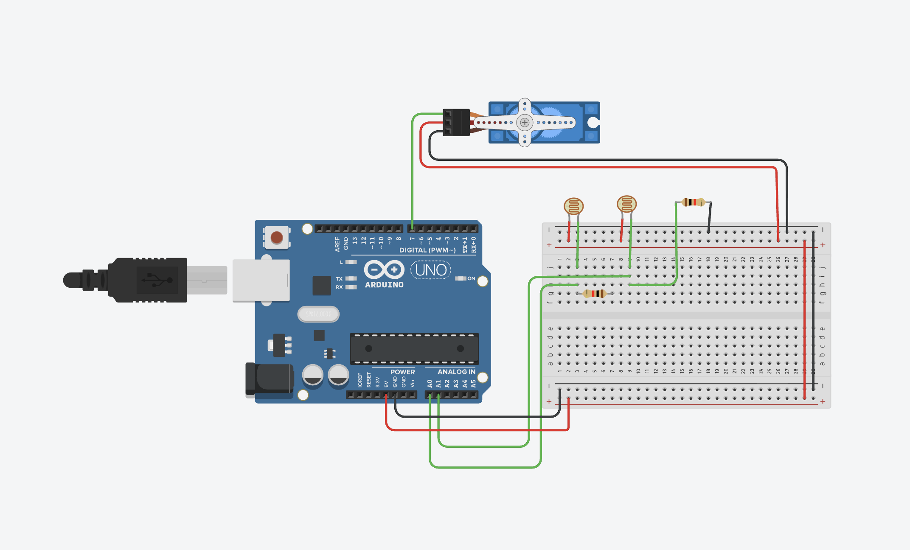

# Solar Tracker - Rastreador Solar com Arduino

## Sobre o Projeto

Este projeto implementa um **rastreador solar** (solar tracker) utilizando Arduino, que ajusta automaticamente a posição de um servo motor baseado na intensidade de luz captada por dois sensores LDR (Light Dependent Resistor). O sistema busca sempre a posição onde há maior incidência de luz, simulando o comportamento de um painel solar que segue o movimento do sol.



## Objetivo

O objetivo principal deste repositório é demonstrar a **evolução de código procedural para Programação Orientada a Objetos (POO)**, mostrando as vantagens de organização, reutilização e manutenibilidade que a POO oferece.

## Componentes Utilizados

- **Arduino** (qualquer modelo compatível)
- **Servo Motor** - conectado ao pino digital 7
- **2x LDR (Light Dependent Resistor)** - conectados aos pinos A0 e A1
- **Resistores** (para divisor de tensão dos LDRs)
- **Protoboard e jumpers**

## Funcionamento

O sistema funciona da seguinte forma:

1. **Leitura dos Sensores**: Os dois LDRs (esquerdo e direito) leem constantemente a intensidade luminosa
2. **Comparação**: O código compara as leituras dos dois sensores
3. **Ajuste de Posição**:
   - Se o LDR esquerdo recebe mais luz → servo gira no sentido horário (`angle++`)
   - Se o LDR direito recebe mais luz → servo gira no sentido anti-horário (`angle--`)
   - Se ambos recebem luz similar → sistema permanece centralizado
4. **Feedback Serial**: Todas as leituras e movimentos são reportados via Serial Monitor

## Comparação: Antes e Depois do POO

### Versão Procedural (`tracker_procedural.ino`)

**Características:**

- Código simples e direto
- Fácil para projetos pequenos
- Variáveis globais podem causar conflitos
- Difícil reutilizar em projetos maiores
- Manutenção mais complexa ao escalar

**Estrutura:**

```cpp
// Variáveis globais
int angle = 90;
int speed = 50;
float LDR1, LDR2;
Servo Servo1;

void setup() {
  // Configuração inicial
}

void loop() {
  // Lógica principal toda aqui
}
```

### Versão POO (`tracker_poo.ino`)

**Características:**

- Código organizado e encapsulado
- Fácil reutilização (pode criar múltiplos trackers)
- Parâmetros configuráveis via construtor
- Manutenção simplificada
- Segue boas práticas de programação

**Estrutura:**

```cpp
class Tracker {
  private:
    // Variáveis encapsuladas
    Servo servo;
    int angle, speed, lowIntensity;

  public:
    // Construtor com valores padrão
    Tracker(byte servoPin, byte ldrLeftPin, byte ldrRightPin,
            int lowIntensity = 100, int startAngle = 90, int speed = 50);

    void begin();   // Inicialização
    void update();  // Atualização do estado
};

// Uso simples e limpo
Tracker tracker(SERVO_PIN, LDR1_PIN, LDR2_PIN);
```

### Principais Vantagens do POO

| Aspecto            | Procedural                    | POO                                  |
| ------------------ | ----------------------------- | ------------------------------------ |
| **Organização**    | Variáveis e lógica espalhadas | Tudo encapsulado na classe           |
| **Reutilização**   | Difícil                       | Fácil (instanciar múltiplos objetos) |
| **Manutenção**     | Complexa em projetos grandes  | Modular e isolada                    |
| **Escalabilidade** | Limitada                      | Excelente                            |
| **Configuração**   | Hardcoded                     | Parâmetros no construtor             |

## Como Usar

### 1. Upload do Código

**Versão Procedural:**

```bash
# Abra tracker_procedural.ino no Arduino IDE
# Selecione sua placa e porta
# Clique em Upload
```

**Versão POO:**

```bash
# Abra tracker_poo.ino no Arduino IDE
# Selecione sua placa e porta
# Clique em Upload
```

### 2. Monitoramento

Abra o **Serial Monitor** (Ctrl+Shift+M) com baud rate **9600** para visualizar:

- Leituras dos LDRs em tempo real
- Movimentos do servo
- Estado do sistema (centralizado ou ajustando)

### 3. Ajustes Opcionais

**Na versão POO**, você pode customizar os parâmetros:

```cpp
// Sintaxe: Tracker(servoPin, ldrLeft, ldrRight, limiarBaixo, anguloInicial, velocidade)

// Exemplo: tracker mais sensível e rápido
Tracker tracker(SERVO_PIN, LDR1_PIN, LDR2_PIN, 50, 90, 30);

// Exemplo: tracker menos sensível e mais lento
Tracker tracker(SERVO_PIN, LDR1_PIN, LDR2_PIN, 200, 90, 100);
```

## Aprendizados

Este projeto demonstra conceitos importantes:

- **Sensoriamento**: Uso de sensores analógicos (LDR)
- **Controle de Servos**: Manipulação precisa de motores
- **Lógica Condicional**: Tomada de decisões baseada em múltiplas entradas
- **POO em Arduino**: Aplicação de classes e objetos em sistemas embarcados
- **Encapsulamento**: Proteção de dados através de modificadores de acesso
- **Construtores**: Inicialização flexível com parâmetros padrão

## Autores

Atividade produzida por Vitor Balbo e Letícia Saravia
